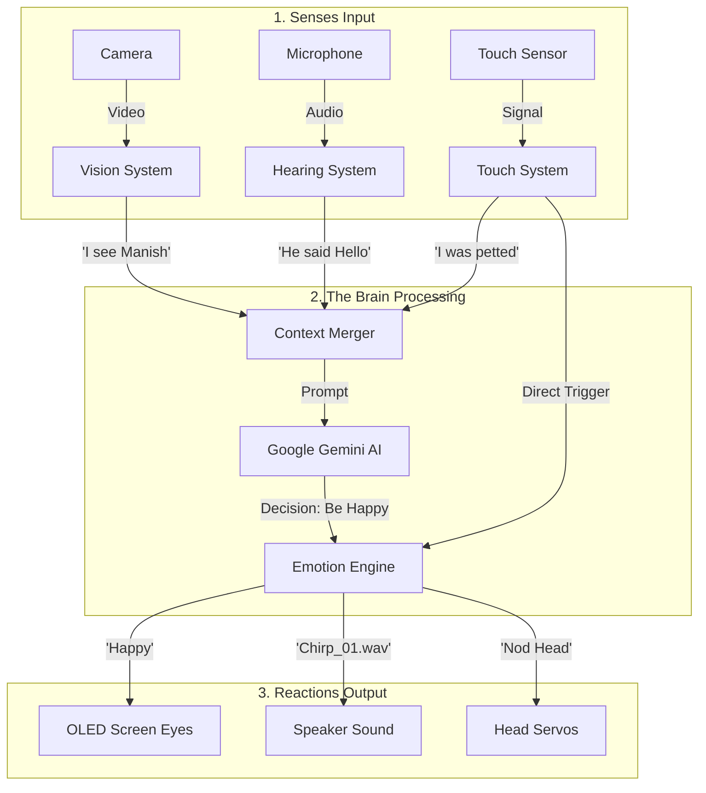
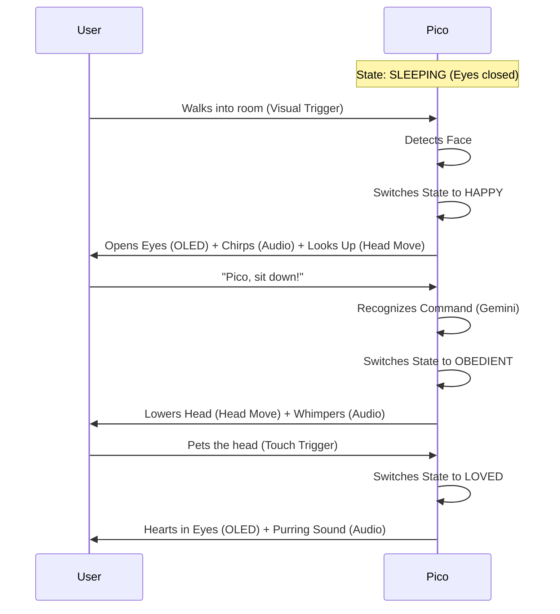

# 📝 Project Design Document: "Pico"
## The AI Desktop Pet

---

## 1. Project Description

Pico is an intelligent, emotionally responsive desktop companion robot. Unlike smart speakers (like Alexa) that just answer questions, Pico behaves like a living pet (like a dog, cat, or a creature like Pokemon).

### Key Personality Traits

- **Non-Verbal**: Pico understands what you say but replies only with sounds (chirps, hums, whistles) and expressions. It does not speak human language.
- **Emotionally Aware**: Pico has moods. It gets happy when it sees you, curious when it hears a noise, and sleepy when left alone.
- **Interactive**: It sees you (Vision), hears you (Audio), and feels touch (Sensors).
- **Stationary but Expressive**: Pico sits on your desk. It cannot walk, but it has a moving head to look at you, nod, or shake its head "no."

---

## 2. Work Flow Diagram (System Architecture)

This diagram explains how the technology works inside Pico. It follows the "Input → Process → Output" logic.

---

## 3. User Flow Diagram (Experience)

This diagram shows a "Day in the Life" of interacting with Pico.

---

## 4. Output Specifications (The "Body Language")

Since Pico doesn't talk, its personality comes from these three outputs working together:

### A. The Eyes (OLED Screen)

Simple, animated shapes that convey emotion.

- **Idle**: `( o o )` (Blinking occasionally)
- **Happy**: `( ^ . ^ )` or `( > < )`
- **Curious**: `( ? . ? )` or One eye big, one small `( O . o )`
- **Sleeping**: `( - . - )` or `( U . U )`
- **Listening**: `( @ . @ )` (Swirling animation)
- **Love**: `( ♥ . ♥ )`

### B. The Voice (Sound Bank)

A collection of `.wav` files stored on the robot.

- **Greeting**: Happy chirps, whistles (like R2-D2)
- **Agreement**: Short, rising hum ("Mm-hmm!")
- **Confusion**: Lower, tilted sound ("Huuuh?")
- **Sad/Scolded**: Low whimper or drop in pitch
- **Purring**: Low rumble when touched

### C. The Movement (Head Servos)

Two small motors (servos) allowing the head to move.

#### Pan Servo (Left/Right)
- Shake head "No"
- Track your face as you move across the room

#### Tilt Servo (Up/Down)
- Nod "Yes"
- Look up at you (Happy)
- Look down at the floor (Sad/Sleepy)

---

## 5. Development Plan (Scratch to Production)

We follow the **Software-First Strategy**: Build the brain on PC, then build the body.

### Phase 1: PC Simulation (The "Virtual Pet")

**Goal**: A program on your laptop that sees, hears, and reacts on your screen.

- **Tech**: Python, OpenCV (Vision), Google Gemini (Brain), PyGame (Audio)
- **Hardware**: Laptop Webcam, Mic, Speakers

**Steps:**
1. Build the Emotion Engine (Code logic)
2. Create the Sound Bank (Collect MP3/WAV files)
3. Implement Vision (Face detection triggers "Happy" state)
4. Implement Hearing (Wake word "Pico" triggers listening)
5. Connect Head Simulation (Print "Head moves UP" on screen)

### Phase 2: Hardware Porting (The "Brain Transplant")

**Goal**: Move the code from the heavy PC to the small ESP32 chip.

- **Tech**: C++, Arduino IDE/PlatformIO
- **Hardware**: ESP32-S3-EYE Board

**Steps:**
1. Purchase the ESP32-S3-EYE
2. Convert Python logic to C++
3. Test Face Detection on the ESP32 chip
4. Test Audio playing from memory (using I2S Amp)

### Phase 3: The Body Construction (Adding Movement)

**Goal**: Give Pico a physical body and moving neck.

- **Hardware**: 2x SG90 Micro Servos, OLED Screen, Speaker, 3D Printed Parts

**Steps:**
1. Wire the Servos to the ESP32
2. Write code to control Servos (e.g., `servo.write(90)`)
3. Sync Movement with Emotion (If Happy, move Servo UP)
4. 3D Print the Head and Base enclosure

### Phase 4: Final Assembly & Production

**Goal**: A finished, polished robot.

**Steps:**
1. Assemble all electronics inside the 3D print
2. Final Wiring and soldering
3. Paint/Decorate the body
4. Final "tuning" (adjusting how fast the head moves, volume of sounds)

---

## 6. Technology Stack (Tools)

| Component | Software/Tool | Hardware |
|-----------|---------------|----------|
| Brain | Google Gemini 1.5 Flash (Free Tier) | ESP32-S3-EYE |
| Vision | OpenCV (Phase 1), ESP-WHO (Phase 2) | 2MP Camera (OV2640) |
| Hearing | Google Speech-to-Text | I2S Digital Mic |
| Voice | Python pygame (Phase 1), I2S Audio (Phase 2) | 1W Speaker + MAX98357 Amp |
| Movement | Servo Library | 2x SG90 Servos (Pan/Tilt) |
| Coding | VS Code, Python, Arduino IDE | Windows 11 PC |

---

## 7. Next Steps for You

### Current Status

We are currently at **Phase 1**.

✅ We have set up the environment  
✅ We have created the EmotionEngine (Step 1)

### Your Immediate Next Task

We need to modify the Emotion Engine code we wrote earlier to support the **"Pet" behavior** (Sounds & Head Movement) instead of "Talking."

---

**Shall we proceed to Update the Code for the Pet Persona?**